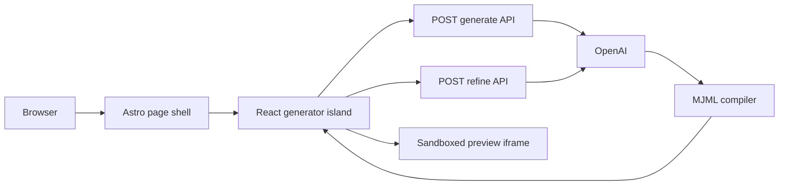

# Architecture

## Runtime Shape

This project uses Astro SSR with React islands. Astro owns routing, metadata, and API endpoints. React owns the interactive generator UI.

## Frontend Responsibilities

- Collect and validate user prompt.
- Show loading, empty, and error states.
- Persist successful drafts in `localStorage`.
- Render subject, preheader, preview, HTML source, and MJML source.
- Send refinement instructions and update the draft when complete.
- Export HTML and MJML.

## Backend Responsibilities

- Keep `OPENAI_API_KEY` private.
- Validate request bodies with zod.
- Enforce primitive rate limits.
- Call OpenAI with Structured Outputs.
- Validate model output with zod.
- Compile MJML to HTML.
- Sanitize compiled HTML.
- Return stable API shapes to the frontend.

## Why No Separate Backend Yet

The MVP does not need accounts, saved server-side drafts, billing, team permissions, or a queue. Astro API routes are enough and keep deployment simple. A separate backend becomes useful once the product needs persistent users or shared data.

## Streaming Note

Browser `EventSource` only supports GET and cannot send the current email body directly. The refine endpoint therefore uses `fetch()` with a readable stream and SSE-style chunks. The first MVP streams progress/status events and returns the final structured email in a `complete` event.
